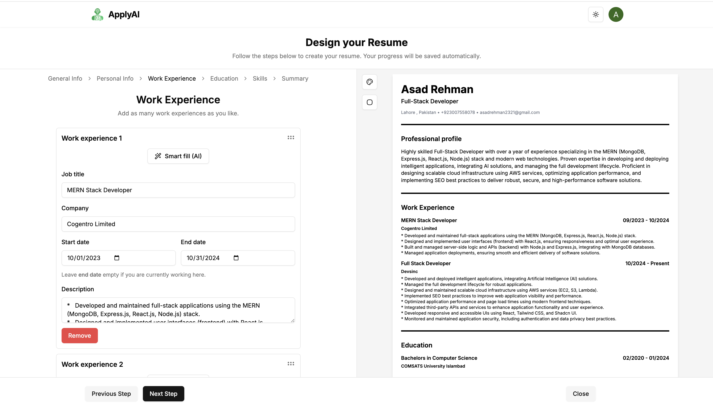
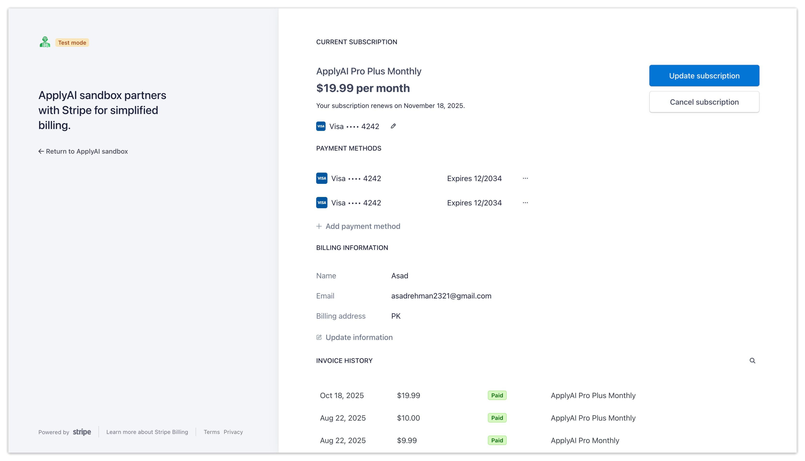

# ApplyAI 📝

**AI Powered Resume Builder SaaS built with Next.js**  
Generate professional resumes in minutes using AI with **Stripe subscriptions**, **Clerk authentication**, and a highly interactive, real time experience.

---

## 🚀 Features

- **AI-Powered Resume Generation**: Generate content using OpenAI for a professional look.  
- **Real Time Editing**: Type and see updates instantly on an A4size resume preview.  
- **Drag & Drop**: Reorder experiences and education using **dnd-kit**, reflected in real time on the resume.  
- **Multiple Subscription Plans**: Three subscription tiers controlling access to features via Stripe.  
- **Stripe Webhooks**: Integrated to handle subscription events in real time.  
- **Environment Management**: Managed using **@t3-oss/env-nextjs** for secure and easy access to environment variables.  
- **Customizations**: Change colors of headings, borders of images, and skill sections.  
- **Light, Dark & System Modes**: Switch between themes seamlessly.  
- **Autosave with Debounce**: Automatic saving of forms and warning on page reload.  
- **Print Ready**: Print resumes directly from the app.  
- **SEO Optimized**: Metadata, OpenGraph images, and structured SEO for better visibility.  
- **Beautiful UI**: Built with **shadcn/ui** for modern, clean interfaces.  
- **Authentication & User Management**: Implemented with **Clerk**.  
- **Global State Management**: Using **Zustand** for smooth state handling.  
- **Form Validation**: **Zod** validation for robust and secure inputs.  
- **File Storage**: **Vercel Blob** used for storing resume files.  
- **React Hooks from Resolvers**: Modular and reusable React logic.  
- **Responsive Design**: Works on mobile, tablet, and desktop screens.  

---

## 🛠 Tech Stack

- **Frontend & SSR**: Next.js  
- **Database**: PostgreSQL with **Prisma ORM**  
- **Authentication**: Clerk  
- **Payments & Subscriptions**: Stripe  
- **AI Content Generation**: OpenAI  
- **State Management**: Zustand  
- **UI Library**: Shadcn UI  
- **Drag & Drop**: Dnd-kit  
- **Validation**: Zod  
- **File Storage**: Vercel Blob  
- **SEO**: Metadata, OpenGraph images  

---

## 📈 How It Works

1. **Sign Up / Sign In** with Clerk authentication.  
2. Choose a subscription plan to unlock features.  
3. Fill in your personal details, experiences, and education.  
4. See live updates on the A4 size resume preview.  
5. Customize colors, borders, and themes.  
6. Save automatically with autosave & reload warning.  
7. Print or download the final resume.  

---

## 📚 Key Highlights

- Real time AI content generation with **OpenAI**.  
- Drag-and-drop reordering of experiences and education.  
- Robust **Zod validation** ensures no invalid data is saved.  
- SEO optimized for better discoverability.  
- Responsive design for all screen sizes: mobile, tablet, PC, laptops.  

---

## 📝 Author

**Asad Rehman** — [GitHub](https://github.com/asadrehman1)  

---

## ⚡ License

MIT © 2025 Asad Rehman
